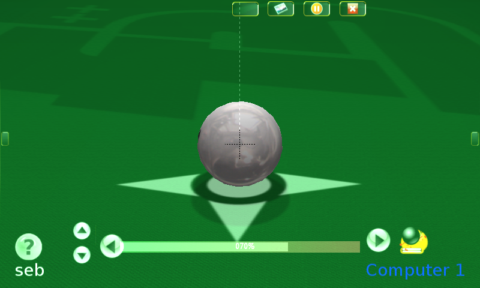
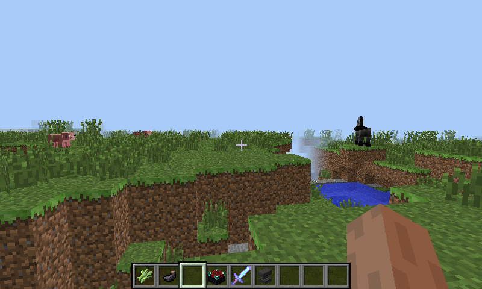
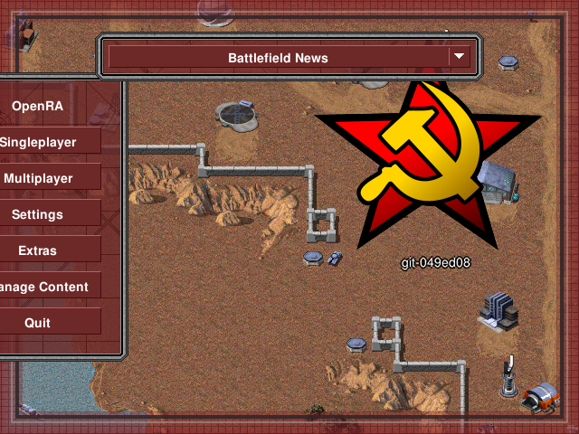

GL4ES - OpenGL for GLES Hardware
====

Many OpenGL software already works with GL4ES.

Complex OpenGL 1.5 games, like Foobillard++, that uses cascaded display list, line stipple and TexGen works fine. Here running on the OpenPandora. It will work with both GLES1.1 and GLES2.0 backend. Most OpenGL 1.x games will runs. 

The limit is an hardware one: GLES1.1 and GLES2.0 hardware do not allow reading Depth buffer, so some games that use it (like AssaultCube) for game play wont run correctly. Some FPS are using it just for cosmetics (Lens flare) and run fine without, like Serious Sam (both First and Second Encounter), here on the OpenPandora again.

More complex program, like Blender, can also run.

But also Minecraft, here on an ODroid in this old video.

On the OpenGL 2.0, side using GLES2.0 backend, OpenRA can run on the Pandora.

And OpenGL 2.x opens a lot of doors. Many commercial games run just fine on gl4es.

Here some FNA games, running on an ODroid XU4 (using method described [there](https://magazine.odroid.com/article/playing-modern-fna-games-on-the-odroid-platform/)). That video show just a few, and even more can be make to run.

And with [Box86](https://github.com/ptitSeb/box86), even more commercial games can run, like here NeverWinter Night on an ODroid XU4

GL4ES also now works on some other platform, like AmigaOS4 (so BigEndian platform)

Here running Foobillard++

Or even in a web browser (that support WebGL): try it with Stunt Car Remake [here](http://ptitseb.github.io/stuntcarremake/)

About performances: while gl4es is a wrapper, there are many caching and works done in gl4es to avoid slowdown and bottleneck. While  those optimization are useless in highly optimised engine, like the Quake3 engine, on other engine and games, gl4es can be (much) faster than staight GLES conversion (especialy if there are a lot of `glBegin(...)`/`glEnd()` drawing commands). On an x86 VM, gl4es running on GLES can be faster than direct OpenGL use on some games!
Now GL4ES can also use VBO, either when the software use it, or automatically when using glList, giving sometimes a nice boost (the boost depend on the Platform and game)
